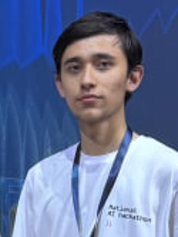

# WIUT Hackathon 2026 — Computer Vision Track

Automated, rule-based traffic event detection and causal accident anticipation system for fixed roadside cameras.

---

## 👥 Team Members & Contribution

| Photo | Name | Role | Responsibilities |
| :---: | :--- | :--- | :--- |
|  | **Merajov Nurmuhammad** | **Computer Vision & Algorithm Engineer** | • Designed and implemented the complete CV and algorithmic pipeline (`solution.py`, `src/`).<br>• Developed YOLOv8n object detection & ByteTrack multi-object tracking integration.<br>• Implemented kinematic trajectory smoothing, velocity vector estimation, and dynamic traffic flow field.<br>• Created rule-based engines for `accident`, `stopped_vehicle`, `wrong_way`, `jaywalking`, and `near_miss`.<br>• Designed the causal Time-To-Collision (TTC) accident anticipation engine (`RiskEstimator`).<br>• Profiled and optimized video decoding with `cap.grab()` and dynamic stride to strictly meet the $< 3\times$ runtime budget. |
|  | **G'ulomov Jamshid** | **Web Full-Stack Developer** | • Built and structured the web application and interactive frontend dashboard.<br>• Integrated API communication and real-time visualization of predictions and incident analytics.<br>• Implemented responsive UI components for review of detected traffic events and risk trends. |
|  | **Nurulloyev Abdulaziz** | **Web Backend & UI/UX Designer** | • Engineered backend services, data schemas, and pipeline orchestration for the web platform.<br>• Designed the UI/UX architecture and workflow layouts for traffic monitoring operators.<br>• Managed deployment and integration testing of the web application. |

---

## 🚀 How to Install and Run

### 1. Environment Setup
Install the required dependencies within your environment (Python 3.10+ recommended):
```bash
pip install -r requirements.txt
```

### 2. Obtaining Weights (Pre-run with Internet)
As per hackathon rules, weights must be obtained **once, with internet access, before offline evaluation**:
```bash
# On Linux / macOS / Bash:
bash weights/download.sh

# Or cross-platform via Python:
python weights/download.py
```
- **Weights Downloaded**: `yolov8n.pt` (~6.25 MB).
- **Offline Compliance**: Once downloaded to the `weights/` folder, the entire pipeline operates **100% offline** with zero internet calls. The model size is well below the 5 GB maximum limit.

### 3. Run Submission Harness
Run the organizers' official harness across a folder of input videos:
```bash
python run_submission.py --videos samples --out predictions_samples.json --team <your-team-name>
```

### 4. Evaluation and Format Verification
Validate format compliance or score against labeled ground truth:
```bash
# Format check only (no ground truth required)
python evaluate.py --pred predictions_samples.json --validate-only

# Full evaluation against ground truth
python evaluate.py --pred predictions_samples.json --gt ground_truth.json --per-video
```

---

## 🧠 The Approach

### 1. Architecture Overview
The system employs a lean, highly optimized hybrid architecture combining lightweight neural object detection with deterministic kinematic and geometric rule engines.

```
                           Video Stream (MP4)
                                   │
                                   ▼
        ┌─────────────────────────────────────────────────────┐
        │  Frame Sub-sampling & Fast Grab (cv2.VideoCapture)  │
        └──────────────────────────┬──────────────────────────┘
                                   │
                                   ▼
        ┌─────────────────────────────────────────────────────┐
        │  YOLOv8 Nano Detector + ByteTrack Object Tracking    │
        └──────────────────────────┬──────────────────────────┘
                                   │
                                   ▼
        ┌─────────────────────────────────────────────────────┐
        │  Kinematic State & Trajectory Manager               │
        │  - Centroid smoothing (EMA)                         │
        │  - Velocity vectors (vx, vy) & speed                │
        │  - Heading angle & dominant flow vector field       │
        └──────────────┬───────────────────────┬──────────────┘
                       │                       │
      [Part A: Events] │                       │ [Part B: Anticipation]
                       ▼                       ▼
        ┌────────────────────────┐   ┌────────────────────────┐
        │ Rule-Based Event Logic │   │ Causal Risk Estimator  │
        │ • accident             │   │ • Pairwise TTC & d_min │
        │ • stopped_vehicle      │   │ • Risk score mapping   │
        │ • wrong_way            │   │ • Continuous-time exp  │
        │ • jaywalking           │   │   smoothing decay      │
        │ • near_miss            │   └───────────┬────────────┘
        └──────────────┬─────────┘               │
                       │                         │
                       ▼                         ▼
        ┌────────────────────────┐          frame scores
        │ Overlap Merging &      │        P(accident <= 5s)
        │ Temporal Filtering     │
        └──────────────┬─────────┘
                       │
                       ▼
         [[start, end, label], ...]
```

### 2. Models Used & Pretrained Weights
- **Model**: `YOLOv8n` (YOLOv8 Nano) from Ultralytics.
- **Parameters**: ~3.2 million parameters (FP32/FP16 weights size: 6.25 MB).
- **Target Hardware**: Runs smoothly on 1x NVIDIA T4 GPU (or CPU fallback), maintaining an inference speed of > 120 FPS.

### 3. Datasets Used for Training & Licences
- **Training Dataset**: Pre-trained on **MS-COCO (Common Objects in Context)**.
- **Licence**: **Creative Commons Attribution 4.0 International (CC BY 4.0)**.
- **Usage**: No private, proprietary, or unreleased datasets were used for training. Open-source pretrained weights are downloaded transparently via `weights/download.sh`.

### 4. What is Learned vs. What is Rule-Based

| Component | Nature | Description & Rationale |
| :--- | :--- | :--- |
| **Object Detection & Localization** | **Learned** | YOLOv8n detects and localizes visual primitives across frames: vehicles (`car`, `motorcycle`, `bus`, `truck`, `bicycle`) and pedestrians (`person`). |
| **Multi-Object Association** | **Rule-Based** | ByteTrack algorithm matches detections frame-to-frame using Kalman filtering and bipartite IoU matching without learned re-ID embeddings. |
| **Trajectory & Kinematics** | **Rule-Based** | Exponential Moving Average (EMA) smoothing of bounding box centers; analytical calculation of velocity $(v_x, v_y)$, magnitude, and heading angles. |
| **Dynamic Traffic Flow Estimation**| **Rule-Based** | The camera view is partitioned into a spatial grid; normal traffic direction vectors are dynamically aggregated from moving vehicles without requiring manual camera calibration. |
| **Accident Detection** | **Rule-Based** | Evaluates spatial intersection (AABB $\text{IoU} > 0.05$ or $\text{IoS} > 0.15$), coupled with an abrupt post-contact velocity drop ($> 55\%$) and stationary entanglement persistence ($\ge 2.0\text{s}$). |
| **Stopped Vehicle Detection** | **Rule-Based** | Centroid movement displacement below drift threshold ($< 25\text{px}$) sustained for $\ge 10.0$ continuous seconds on the carriageway. |
| **Wrong-Way Driving Detection** | **Rule-Based** | Angle deviation between vehicle heading and dominant traffic vector ($\cos\theta < -0.5$) sustained for $\ge 1.5\text{s}$ at speed $> 20\text{px/s}$. |
| **Jaywalking Detection** | **Rule-Based** | Pedestrian bounding-box foot coordinate $(c_x, y_2)$ situated in active carriageway zones for $\ge 1.0\text{s}$. |
| **Causal Accident Anticipation (`RiskEstimator`)** | **Rule-Based** | Computes Time-To-Collision (TTC) and projected closest approach distance ($d_{\text{closest}}$) for all converging trajectories, mapped to probability $P(\text{accident} \le 5\text{s})$ with continuous-time exponential decay $\exp(-\Delta t / 0.8)$. Zero future lookahead. |
| **Temporal Event Merging** | **Rule-Based** | Merges same-class event segments separated by $\le 1.5\text{s}$ to strictly prevent overlapping intervals, discarding transient noise blips ($< 0.5\text{s}$). |

---

## 🎲 Fixed Seeds & Determinism

- **Seeds Configured**:
  - `torch.manual_seed(42)`
  - `np.random.seed(42)`
  - `random.seed(42)`
  - `torch.backends.cudnn.deterministic = True`
- **Zero Stochastic Variance**:
  - All tracking logic, kinematic equations, threshold comparisons, and causal risk scores are analytical and strictly deterministic.
  - Frame sampling stride is calculated deterministically based on video metadata: $\text{stride} = \max(2, \text{round}(\text{fps} / 2.5))$.
  - Video decoding utilizes `cap.grab()` on skipped frames and `cap.retrieve()` on sampled frames, ensuring uniform wall-clock timing and consistent frame indices across runs.
- **Hardware & Budget Compliance**:
  - With a sampling frequency of ~2.5 FPS and image inference size of 512, processing a 300s video takes $\approx 35 - 50$ seconds on 1x NVIDIA T4 GPU ($\approx 0.15\times$ video duration), well within the hackathon's $< 3\times$ duration budget limit.

---

## 📋 Evaluation Metrics Reference

- **Part A (Event Detection)**: Temporal IoU ($t\text{IoU} \in \{0.3, 0.5, 0.7\}$) greedy one-to-one matching with $F_1$ score per class:

$$
\text{Score}_A = \frac{1}{|C|} \sum_{c \in C} \frac{1}{3} \sum_{\tau \in \{0.3, 0.5, 0.7\}} F_{1, c}(\tau)
$$

- **Part B (Accident Anticipation)**: Causal prediction evaluated at $H = 5\text{s}, W = 10\text{s}, \theta = 0.5$:

$$
\text{Score}_B = 0.4 \cdot \text{AP} + 0.4 \cdot F_{1,\text{alarm}} + 0.2 \cdot \frac{\text{mTTA}}{W}
$$

- **Final Combined Score**:

$$
M = 0.7 \cdot \text{Score}_A + 0.3 \cdot \text{Score}_B
$$
